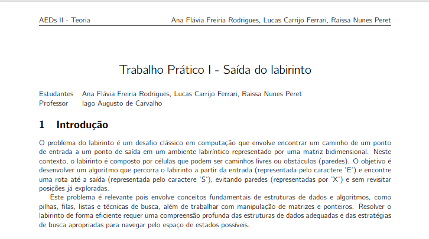

# Tarefa Prática 1 - AEDs II



## Alunos

- Ana Flávia Freiria Rodrigues
- Lucas Carrijo Ferrari
- Raissa Nunes Peret

## Informações importantes

### Como mudar o labirinto que será lido?

Dentro da função `main` do arquivo `source/main.c` existe uma constante chamada `caminhoArquivo`. O projeto tentara encontrar o labirinto indicado nesta constante.

## Como executar

1. Navegue até a pasta `source/labirinto`

```
cd ~/tp_1__aeds_II/labirinto
```

2. Execute o arquivo make

```
make
```

3. Execute o `labirinto`

```
./labirinto
```
